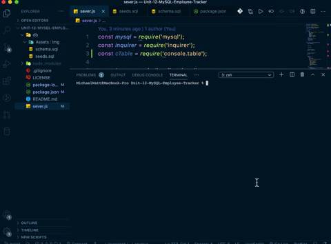

# Unit 12 MySQL Homework: Employee Tracker

[](http://unlicense.org/)<br />

## Description

Developers are often tasked with creating interfaces that make it easy for non-developers to view and interact with information stored in databases. Often these interfaces are known as Content Management Systems. This homework assignment, the challenge is to architect and build a solution for managing a company's employees using node, inquirer, [ASCII-art Logo](https://www.npmjs.com/package/asciiart-logo) and MySQL

 

Or the full video is [here](./Assets/img/Untitled.mov)


## Instructions

1. Clone this GitHub repository

   ```
   git clone git@github.com:Michaelmw17/Unit-12-MySQL-Employee-Tracker.git
   ```

2. Install all dependent npm packages

   ```
   npm install --save
   ```
Design the following database schema containing three tables:


* **department**:

  * **id** - INT PRIMARY KEY
  * **name** - VARCHAR(30) to hold department name

* **role**:

  * **id** - INT PRIMARY KEY
  * **title** -  VARCHAR(30) to hold role title
  * **salary** -  DECIMAL to hold role salary
  * **department_id** -  INT to hold reference to department role belongs to

* **employee**:

  * **id** - INT PRIMARY KEY
  * **first_name** - VARCHAR(30) to hold employee first name
  * **last_name** - VARCHAR(30) to hold employee last name
  * **role_id** - INT to hold reference to role employee has
  * **manager_id** - INT to hold reference to another employee that manages the employee being Created. This field may be null if the employee has no manager
  
Build a command-line application that at a minimum allows the user to:

  * Add departments, roles, employees

  * View departments, roles, employees

  * Update employee roles

We can frame this challenge as follows:

```
As a business owner
I want to be able to view and manage the departments, roles, and employees in my company
So that I can organize and plan my business
```

##  Requirements

* Functional application.

* GitHub repository with a unique name and a README describing the project.

* The command-line application should allow users to:

  * Add departments, roles, employees

  * View departments, roles, employees

  * Update employee roles

### Resources

* Use the [MySQL](https://www.npmjs.com/package/mysql) NPM package to connect to your MySQL database and perform queries.

* Use [InquirerJs](https://www.npmjs.com/package/inquirer/v/0.2.3) NPM package to interact with the user via the command-line.

* Use [console.table](https://www.npmjs.com/package/console.table) to print MySQL rows to the console. There is a built-in version of `console.table`, but the NPM package formats the data a little better for our purposes.

### Hints

* You may wish to include a `seed.sql` file to pre-populate your database. This will make development of individual features much easier.

* Focus on getting the basic functionality completed before working on more advanced features.

* Review the week's activities for a refresher on MySQL.

* Check out [SQL Bolt](https://sqlbolt.com/) for some extra MySQL help.
